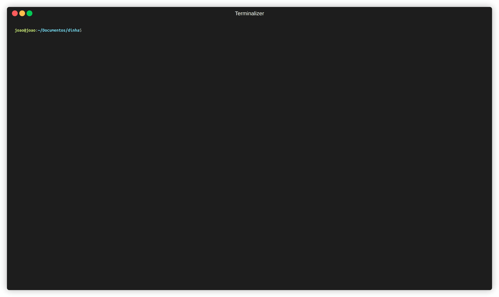

# Dinha
Is your `downloads` folder full of **useless files**, downloaded a long time ago, but you don't have the enough time or courage to delete them? Dinha can help you manage that wasted space in you storage 🪄

It's very simple, you can indicate which folders Dinha will keep an eye on for you, set an expiration date and you will be notified which files you don't use a lot of time and should delete them 🧙

Features 💥
- Get notified when files haven't been used for a long time 🕰️
- Select which folders will be monitored 📁
- Schedule automatic deletions for unused files 🧹

# Usage


You will need to install [Go 1.21+](https://go.dev/dl/).

Now we just need to start daemon service:
```bash
go run ./cmd/dinha-daemon
```

Then, in another terminal, we can open our manager:
```bash
go run ./cmd/dinha
```

## Building

```bash
go build -o bin/dinha ./cmd/dinha
go build -o bin/dinha-daemon ./cmd/dinha-daemon
```
